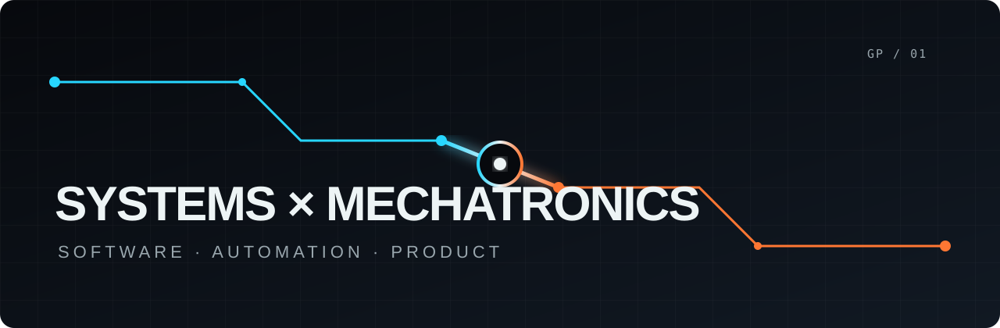

#  Hola, soy Giusseppe Piminchumo 👋

### Product Engineer · Systems × Mechatronics × Software × Automation

Soy **Product Engineer** e Ingeniero de Sistemas con formación en Ingeniería Mecatrónica. Me gusta trabajar justo donde muchos mundos se encuentran: producto, software industrial, automatización, sistemas embebidos, IoT, datos e inteligencia artificial.

Mi perspectiva recorre el sistema completo:

> **sensor / PLC → firmware → comunicación → backend → datos → interfaz → producto → usuario**

No veo hardware y software como disciplinas separadas. Los uso como partes de una misma solución para convertir problemas reales de ingeniería en productos claros, conectados y útiles.

## Lo que construyo

- ⚙️ Productos de software conectados con máquinas, PLC y microcontroladores
- 🧠 Experiencias con IA aplicada, RAG, automatización y visión artificial
- 🌐 Servicios e interfaces con Python, FastAPI, React y APIs REST
- 📡 Sistemas IoT con ESP32, STM32, MQTT, RS485, USB, Wi-Fi y Ethernet
- 🧭 Decisiones de producto que conectan tecnología, usuario y negocio

## Tecnologías

#### Software & Product

#### Industrial & Embedded

#### Data, AI & Delivery

## Proyectos que estoy preparando

### 🌱 Agri-Smart Bloom Vision

Sistema IoT agrícola que conecta firmware ESP32, MQTT, backend en Python y una interfaz React para monitorear variables ambientales en tiempo real.

### 👁️ Clasificación industrial con visión artificial

Sistema que integra YOLOv8, PLC, Raspberry Pi y movimiento robótico para detectar y clasificar la madurez de frutas en una línea transportadora.

Publicaré cada repositorio cuando tenga código útil, documentación clara y suficiente contexto para que otras personas puedan aprender, reutilizar o colaborar.

## Encuéntrame en

> Building at the intersection of **physical systems, digital products, and human decisions**.
